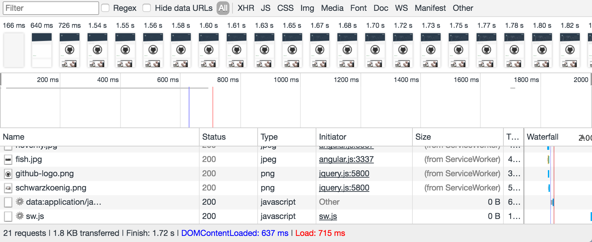

# Usage
```sh
$ npm i -g gulp-cli
$ npm i -g bower
$ yarn
$ gulp serve
```

Service worker ist in `src/assets/js/app.js` ganz unten definiert.

`sw.js` ist in `src/sw.js`


# Service Worker
## Steps
* check if serviceWorker are available in `assets/js/app.js`
* in `sw.js` install the new cache
* define the files to be cached
* fetch the cached files when loaded 

## Difference
### Before
Before adding the service worker 3MB are loaded and the first render happens after 832ms, which is quite long.


### After
After adding the Service Worker most assets are cached and only 1.8KB are transferred, also the initial render time is reduced by almos 200ms.

